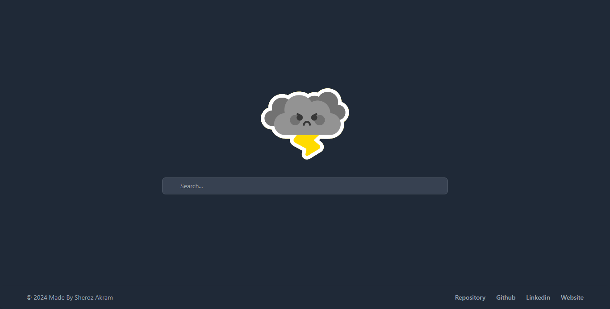
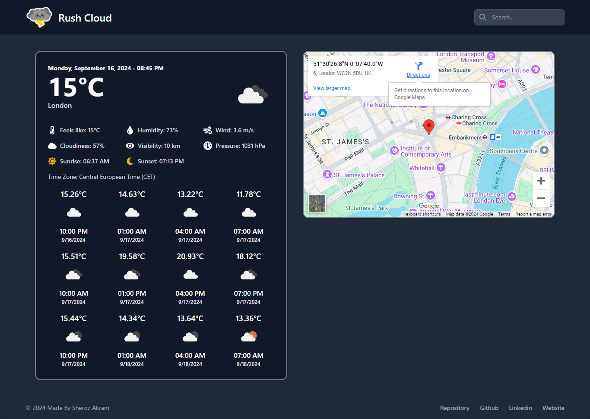

## Rush Cloud - Weather Application
Our Weather App, built with React, lets you easily search for and select cities to view current weather conditions and forecasts. You can explore detailed weather data such as temperature, wind speed, and pressure, as well as sunrise and sunset times. The app also integrates Google Maps to show the selected location visually. Whether you're planning your day or just curious about the weather, this app provides all the information you need in one convenient place.

### Features
1. **City Search and Selection:** Easily search for and select cities from a list to view their weather details.
2. **Current Weather Details:** View real-time weather information including temperature, weather description, wind speed, and atmospheric pressure.
3. **Detailed Weather Forecast:** Access a forecast for upcoming days, helping you plan ahead with detailed weather predictions.
4. **Sunrise and Sunset Times:** Get information on sunrise and sunset times for the selected location.
5. **Google Maps Integration:** See the selected location on an interactive Google Map, providing a visual reference of where the weather data applies.

### Screenshots




### Installation

1. **Clone the Repository**
   ```bash
   git clone https://github.com/Sheroz-Akram/weather-react.git
   cd weather-app

2. **Install Dependencies**
   ```bash
   npm install

3. **Start the Development Server**
   ```bash
   npm start

3. **npm run build**
   ```bash
   npm run build